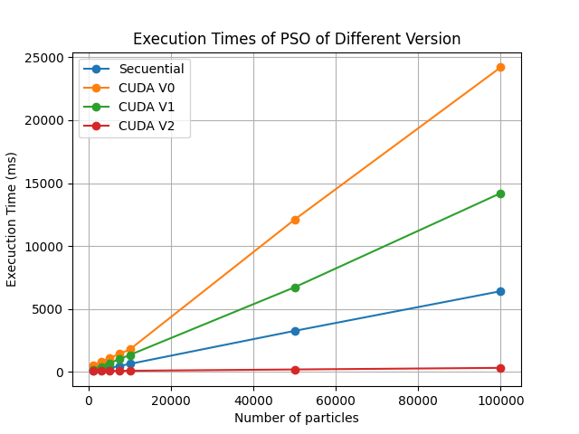
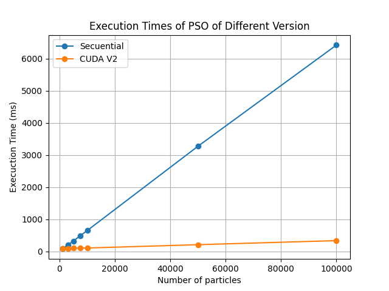

# PSO Implementation in CUDA

These are PSO Implementations for my Parallel Computing Class
- Secuential version is very based in [this](https://github.com/kailin-lu/CUDA-PSO/blob/main/pso-cpu.cpp) repositorie.
- CUDAV1 doesn't use shared memory
- CUDAV2 does use shared memory

## Useful Video
[Video](https://www.youtube.com/watch?v=HmDjfL3R39M&pp=ugMICgJlcxABGAHKBQNwc28%3D) that help me to understand PSO

## Results
### All versions

### Secuential vs CUDAV2

